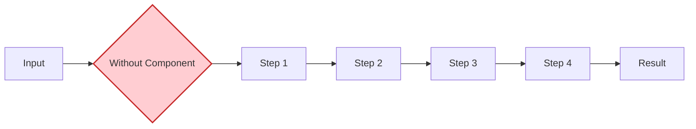
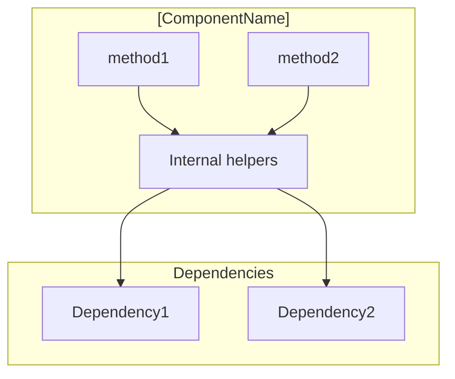
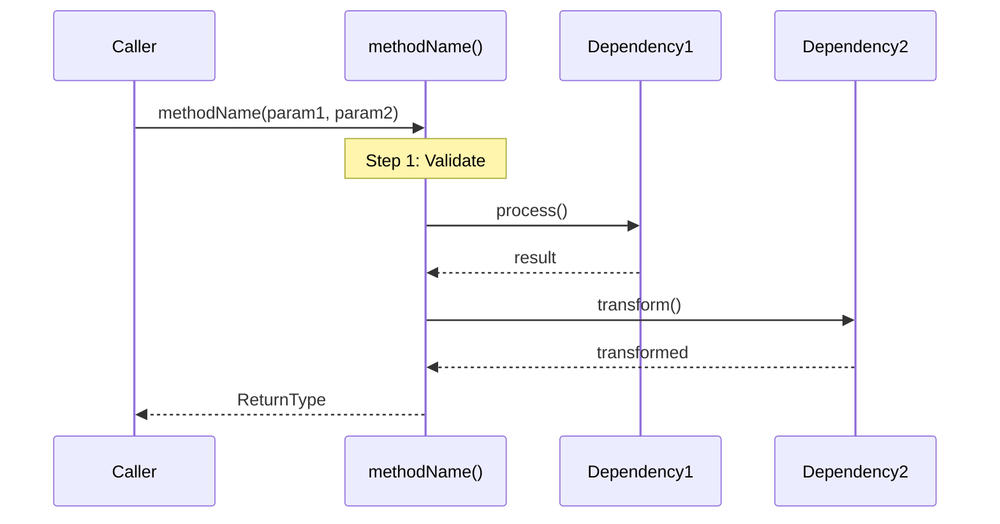
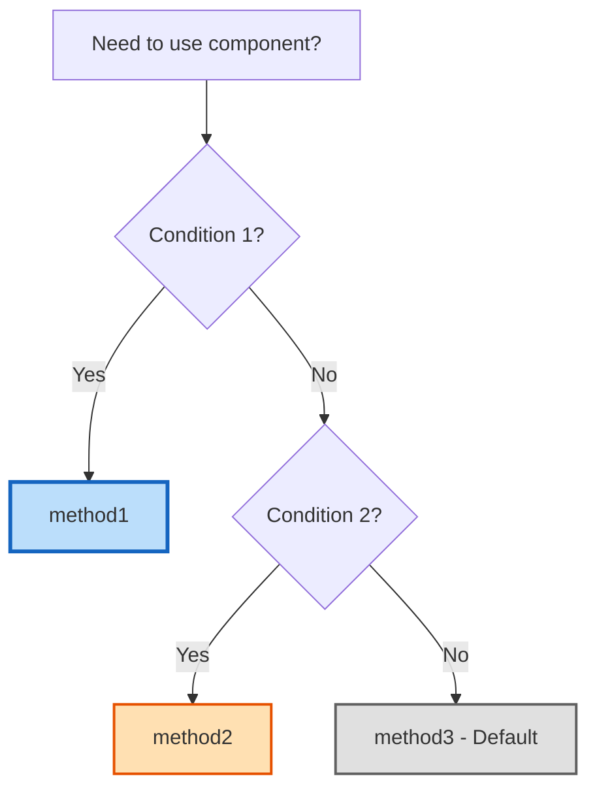

# Component Template

## Overview

This template defines the structure for deep-dive component analysis.
Focus on what developers need to understand, use, debug, and extend this component.
ALL content must be based on actual code - never make assumptions.

---

## Output Template

````markdown
# [Component Name] Deep Dive

## Table of Contents
1. [Overview & Purpose](#overview--purpose)
2. [The Core Problem It Solves](#the-core-problem-it-solves)
3. [Key Features & Design Decisions](#key-features--design-decisions)
4. [Architecture](#architecture)
5. [Public Methods](#public-methods)
6. [Decision Guide: Which Method to Use?](#decision-guide-which-method-to-use)
7. [Real-World Scenarios](#real-world-scenarios)
8. [Debugging & Observability](#debugging--observability)
9. [Key Takeaways](#key-takeaways)
10. [Next Steps for Learning](#next-steps-for-learning)

---

## Overview & Purpose

### What is [ComponentName]?

[2-3 paragraphs explaining what this component does and its role in the system.]

**File**: [Component.kt](../src/main/kotlin/com/example/Component.kt) ([X] lines)

### Key Characteristics

- **Architecture Pattern**: [e.g., Strategy pattern, Facade, Service layer]
- **Key Responsibility**: [One sentence describing what this component owns]
- **Design Principles**: [e.g., Single Responsibility, Dependency Injection]
- **Core Dependencies**: [List 2-3 main dependencies this component relies on]
- **Stateless/Stateful**: [Whether component maintains state between calls]

### The One-Line Summary

> **[ComponentName] [does X] by [doing Y] to [achieve Z].**

---

## The Core Problem It Solves

### Without This Component

[Explain what you'd have to do manually without this component.]



### With This Component

```kotlin
// Simple API call that handles all complexity
val result = componentName.method(input)
// Done. All steps handled internally.
```

---

## Key Features & Design Decisions

[List of major architectural and implementation decisions - NO diagrams here. Diagrams belong in method sections.]

- **[Feature/Decision 1]**: [Brief explanation of what it is and why this approach was chosen]
- **[Feature/Decision 2]**: [Brief explanation]
- **[Feature/Decision 3]**: [Brief explanation]
- **[Feature/Decision 4]**: [Brief explanation]

---

## Architecture

### Component Position in System

```
[ParentService] (Entry Point)
    ↓
[ThisComponent] (This Component - [Role])
    ↓
[ChildComponent] (Next Layer)
    ↓
[ExternalService] (External Dependency)
```

### Component Structure



---

## Public Methods

### Method: [methodName]()

**File**: [Component.kt](../src/main/kotlin/com/example/Component.kt) (Lines X-Y)

**Purpose**: [What this method does - one sentence]

#### Signature

```kotlin
fun methodName(
    param1: Type1,
    param2: Type2 = defaultValue
): ReturnType
```

#### Parameters

- `param1` (Type1, required) - [What it's used for]
- `param2` (Type2, optional) - Default: `value`. [What it controls]

#### Returns

- `ReturnType` containing [description of what's returned]

#### Processing Behavior

**Step 1: [Name]** (Lines X-Y)

[Detailed explanation of what happens in this step]

```kotlin
// Lines X-Y: [Description]
val result = someOperation(param1)
if (result.isEmpty()) {
    return defaultValue
}
```

**Step 2: [Name]** (Lines X-Y)

[Detailed explanation of what happens]

```kotlin
// Lines X-Y: [Description]
val processed = dependencies.map { dep ->
    dep.process(result)
}.filter { it.isValid }
```

**Step 3: [Name]** (Lines X-Y)

[Detailed explanation]

```kotlin
// Lines X-Y: [Description]
return buildResponse(processed)
```

#### Flow Diagram



#### Edge Cases

- **[Case 1]**: [What happens] (Line X)
- **[Case 2]**: [What happens] (Line Y)

---

### Method: [secondMethodName]()

**File**: [Component.kt](../src/main/kotlin/com/example/Component.kt) (Lines X-Y)

**Purpose**: [What this method does]

[Same structure as above: Signature, Parameters, Returns, Processing Behavior with code, Flow Diagram, Edge Cases]

---

## Decision Guide: Which Method to Use?



### When to Use Each Method

| Method | Use Case | Latency |
|--------|----------|---------|
| `method1()` | [Primary use case] | [X-Yms] |
| `method2()` | [Secondary use case] | [X-Yms] |

---

## Real-World Scenarios

### Scenario 1: [Common Use Case Name]

**Context:** [Brief description of when this happens]

```kotlin
// Example usage
val result = componentName.method(
    param1 = input,
    param2 = configuration
)
```

**What happens internally:**
1. [Step 1]
2. [Step 2]
3. [Step 3]

**Request payload:**
```json
{
  "field1": "value1",
  "field2": 123
}
```

**Response payload:**
```json
{
  "status": "success",
  "data": { ... }
}
```

---

### Scenario 2: [Edge Case / Error Handling]

**Context:** [When this happens]

```kotlin
try {
    componentName.method(request)
} catch (e: SpecificException) {
    // Fallback handling
    logger.error("Operation failed", e)
    fallbackMethod(request)
}
```

---

## Debugging & Observability

### Common Issues & Debugging

**Issue: [Symptom/Error message from actual code]**

- **Cause**: [Root cause found in code]
- **Solution**: [How to fix based on code]
- **Location**: Line X in `Component.kt`

---

**Issue: [Another common problem from actual code]**

- **Cause**: [Root cause]
- **Solution**: [How to fix]

---

## Key Takeaways

1. **[Takeaway 1]** - [One sentence explanation]
2. **[Takeaway 2]** - [One sentence explanation]
3. **[Takeaway 3]** - [One sentence explanation]
4. **[Takeaway 4]** - [One sentence explanation]
5. **[Takeaway 5]** - [One sentence explanation]

---

## Next Steps for Learning

### Related Components

- **[Related Component 1]** - [Why study this next]
- **[Related Component 2]** - [Why study this next]

### Common Questions

**Q: [Frequently asked question 1]?**
A: [Clear answer]

**Q: [Frequently asked question 2]?**
A: [Clear answer]

---

*Last Updated: [DATE]*
````

---

## Guidelines

**CRITICAL: All content must be based on actual code**
- Never make up metrics, configurations, or behaviors
- If something doesn't exist in the code, don't include it
- Only document what you can verify by reading the source

**Key Features & Design Decisions:**
- Simple list of architectural/implementation decisions
- NO diagrams in this section
- Brief explanations of WHY each decision was made

**Public Methods - CENTRALIZED per method:**
- Each method section includes ALL related content:
  - Signature and parameters
  - Processing Behavior with detailed code snippets
  - Line references for each step
  - Flow diagram specific to this method
  - Edge cases
- Do NOT create separate "Algorithm Details" section

**Tables vs Lists:**
- **LISTS for**: Parameters, characteristics, steps, features
- **Tables ONLY for**: Method comparisons (method | use case | latency)

**Debugging & Observability:**
- Only include issues/logging actually found in code
- Do NOT make up metrics or tracing functionality
- If no observability exists in code, note that explicitly

**Do NOT include:**
- "Usage from:" references
- Configuration section (input params already in method signatures)
- Made-up metrics or tracing
- Anything not verified in actual source code

---

## Success Criteria

Component document is complete when:

- Table of Contents present
- Component file reference as clickable link: [Name.kt](../path/to/Name.kt)
- "The Core Problem It Solves" with before/after
- Key Features as simple list (no diagrams)
- Architecture section with component position
- Each Public Method has:
  - Signature, parameters, returns
  - Processing Behavior with code snippets and line refs
  - Flow diagram for that method
  - Edge cases
- Decision Guide (if multiple methods)
- Real-World Scenarios with JSON payloads
- Debugging based on actual code (no made-up metrics)
- Key Takeaways (5-7 points)
- ALL content verified against actual source code
