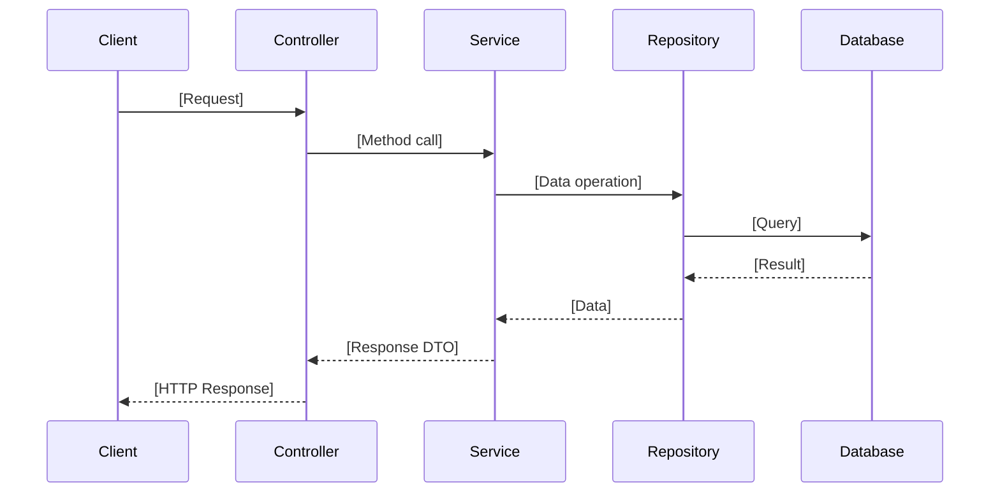

# Flow Template

## Overview

This template defines the structure for documenting a specific data or request flow.
Trace the actual code path and include file:line references for each step.

---

## Output Template

````markdown
# Flow: [Flow Name]

> Generated: [DATE]
> Flow Type: [Request/Event/Batch/CLI]

## Table of Contents

1. [Overview](#overview)
2. [Flow Diagram](#flow-diagram)
3. [Step-by-Step Flow](#step-by-step-flow)
4. [Data Transformations](#data-transformations)
5. [External Service Interactions](#external-service-interactions)
6. [Error Handling](#error-handling)
7. [Performance Considerations](#performance-considerations)
8. [Next Steps: Related Flows](#next-steps-related-flows)

---

## Overview

**Purpose**: [What this flow accomplishes]

**Trigger**: [What initiates this flow - HTTP request, event, cron job, etc.]

**Entry Point**: [EntryFile.kt](../src/main/kotlin/com/example/EntryFile.kt) (Line 45)

**End State**: [What state exists after the flow completes]

## Flow Diagram



## Step-by-Step Flow

### Step 1: [Entry Point Name]

**File**: [FileName.kt](../src/main/kotlin/com/example/FileName.kt) (Line XX)

**Input**:
```typescript
// Request structure or input parameters
{
  param1: string,
  param2: number
}
```

**Processing**:
[What happens at this step - validation, parsing, etc.]

**Output**:
[What is passed to the next step]

**Code Reference**:
```typescript
// Relevant code snippet (keep brief)
```

---

### Step 2: [Service/Handler Name]

**File**: [FileName.kt](../src/main/kotlin/com/example/FileName.kt) (Line XX)

**Input**:
[What comes from Step 1]

**Processing**:
[Business logic applied]

**Output**:
[What is produced]

**External Calls**: [If any - database, API, etc.]

---

### Step 3: [Continue for each significant step...]

---

## Data Transformations

| Step | Input Shape | Output Shape | Transformation |
|------|------------|--------------|----------------|
| 1→2 | Request DTO | Service Input | Validation + mapping |
| 2→3 | Service Input | Query Params | Business logic |
| 3→4 | Query Result | Response DTO | Data shaping |

## External Service Interactions

### [Service Name 1]

**Called At**: Step [N], `[file:line]`

**Purpose**: [Why this service is called]

**Request**:
```json
{
  "field": "value"
}
```

**Response**:
```json
{
  "result": "data"
}
```

**Error Handling**: [What happens if this fails]

---

### [Database Operations]

**Called At**: Step [N], `[file:line]`

**Operation**: [SELECT/INSERT/UPDATE/DELETE]

**Query**:
```sql
-- Actual query or ORM method
SELECT * FROM users WHERE id = ?
```

**Tables Affected**: [table names]

---

## Error Handling

### Validation Errors

**File**: [FileName.kt](../src/main/kotlin/com/example/FileName.kt) (Line XX)

**Trigger**: [When this error occurs]

**Response**:
```json
{
  "error": "validation_failed",
  "details": [...]
}
```

**Status Code**: 400

---

### [Service Name] Failure

**File**: [FileName.kt](../src/main/kotlin/com/example/FileName.kt) (Line XX)

**Trigger**: [External service timeout/error]

**Handling**: [Retry? Fallback? Fail?]

**Response**:
```json
{
  "error": "service_unavailable"
}
```

**Status Code**: 503

---

### Unhandled Errors

**Global Handler**: `[file:line]`

**Logging**: [What gets logged]

**Response**: [Generic error response]

---

## Performance Considerations

- [Any caching involved]
- [Async operations]
- [Batch processing]
- [Known bottlenecks]

## Next Steps: Related Flows

After understanding this flow, consider exploring:

| Flow | Relationship | Documentation |
|------|-------------|---------------|
| [Related Flow 1] | [How it connects] | [Link or "Not yet documented"] |
| [Related Flow 2] | [How it connects] | [Link or "Not yet documented"] |

---
*This document traces the actual code path. All steps verified against source code.*
````

---

## Diagram Guidelines

**Use sequence diagram when:**
- Multiple actors/services communicate
- Order of operations matters
- Request/response patterns

**Use flowchart when:**
- Decision points and branching
- State transitions
- Complex conditional logic

**Keep diagrams focused:**
- Include only significant steps
- Don't diagram every function call
- Group related operations

---

## Guidelines

- Trace the actual code, don't guess the flow
- Include file:line for every step
- Show actual request/response shapes when possible
- Document what happens on failure, not just success
- If you can't trace a step, note it explicitly

---

## Success Criteria

Flow document is complete when:

- Table of Contents present
- Entry point identified with file reference: [Name.kt](../path) (Line XX)
- Each step has file reference and input/output documented
- Flow diagram (sequence or flowchart) included
- External service interactions documented
- Error handling paths documented
- Data transformations table shows shape changes
- Related flows suggested in "Next Steps"
- Diagrams rendered to images
