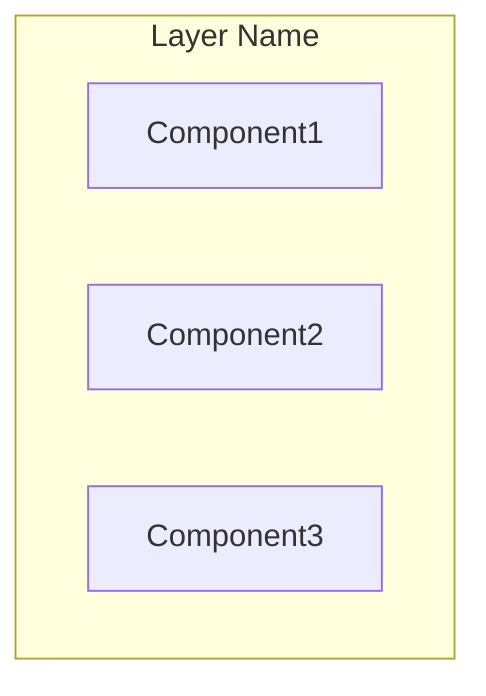
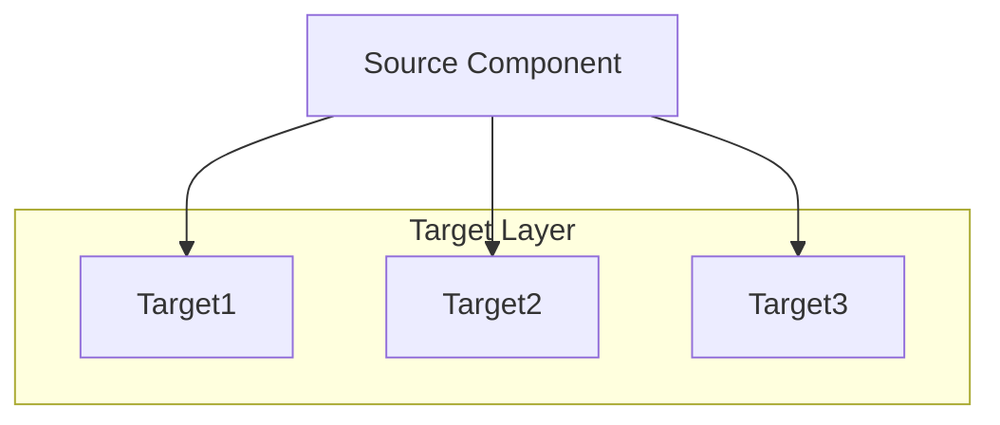
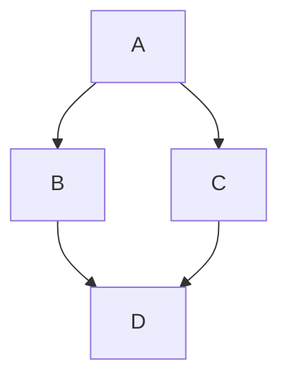
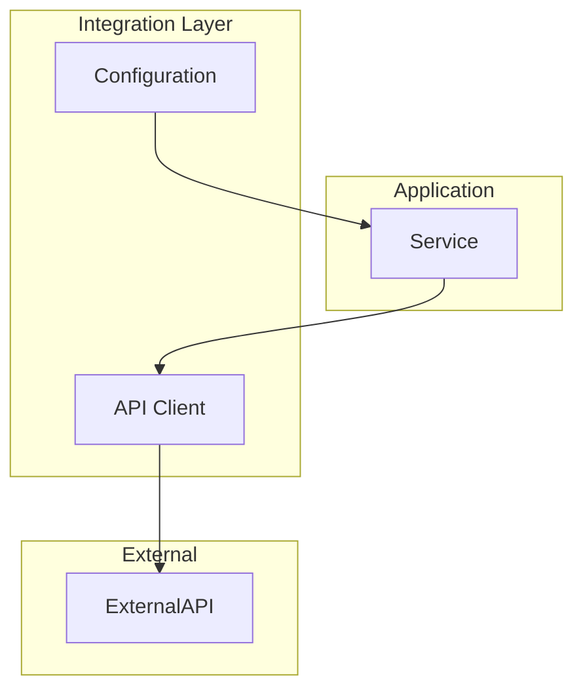
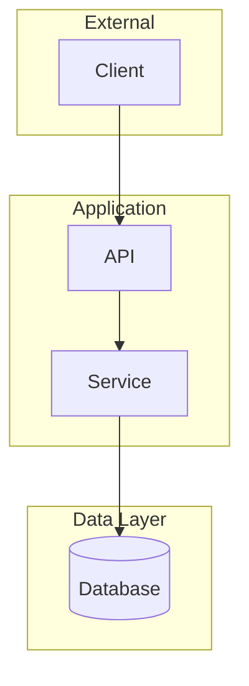
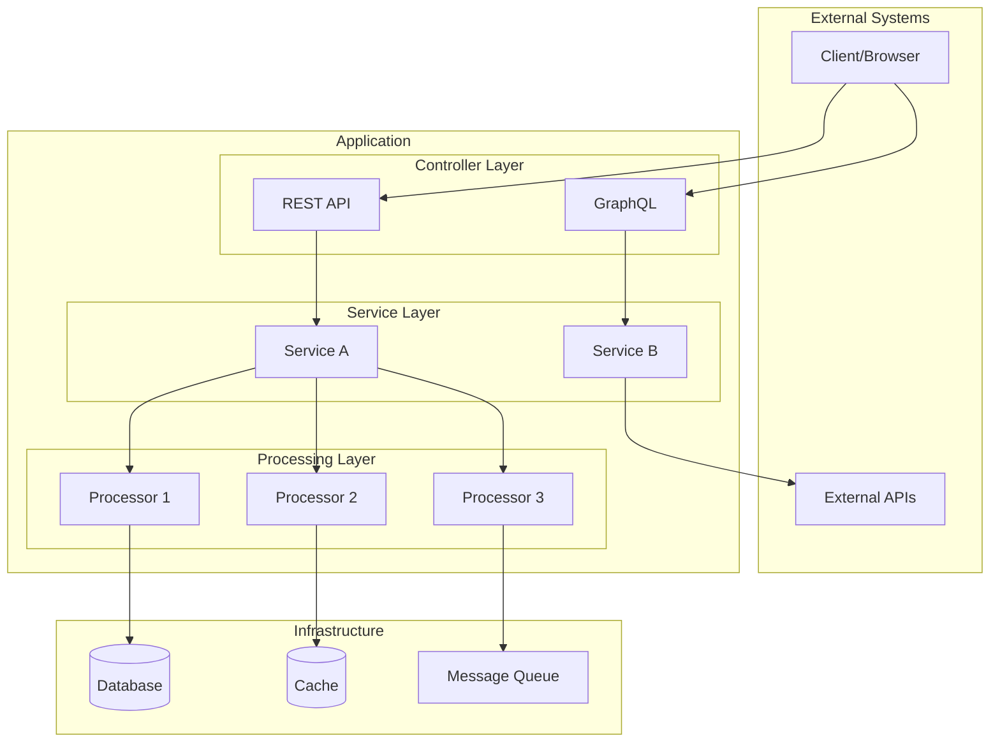

# Mermaid Best Practices

Best practices for generating clean, readable Mermaid architecture diagrams with non-overlapping arrows and proper layouts.

---

## Rules

### Use `flowchart` instead of `graph`

`flowchart` has better edge routing algorithms than `graph`.


Not:


---

### Set explicit direction for subgraphs

Use `direction LR` for horizontal layouts within vertical (TB) diagrams when you have multiple parallel components:



This prevents components from stacking vertically and causing arrow overlaps.

---

### Fan-out pattern for multiple connections

When one component connects to multiple targets, ensure targets are in a subgraph with `direction LR` so arrows fan out cleanly rather than overlap:



---

### Keep related nodes in the same subgraph

Group nodes that share many connections to minimize edge crossings. Nodes in the same subgraph have shorter, cleaner connections.

---

### Order connection definitions logically

Define edges in visual order (left-to-right, top-to-bottom) as Mermaid sometimes uses definition order for layout hints:



---

### Avoid deep subgraph nesting

Maximum 2 levels of nesting. Flatten when possible.

**Bad:**
```mermaid
subgraph L1
    subgraph L2
        subgraph L3
            A
        end
    end
end
```

**Good:**
```mermaid
subgraph L1
    subgraph L2
        A
    end
end
```

---

### Move "bridge" components strategically

If a component connects two layers (like an API client or config), place it in the layer where it has fewer connections, or create a dedicated config/integration subgraph:



---

### Use invisible links for alignment when needed

```mermaid
flowchart TB
    A ~~~ B  %% invisible link to align A and B horizontally
```

This forces nodes to be on the same rank without a visible connection.

---

### Declare nodes before edges

Define all nodes in subgraphs first, then define all edges at the bottom of the diagram:



---

## Recommended Template

**Recommended architecture diagram structure:**


