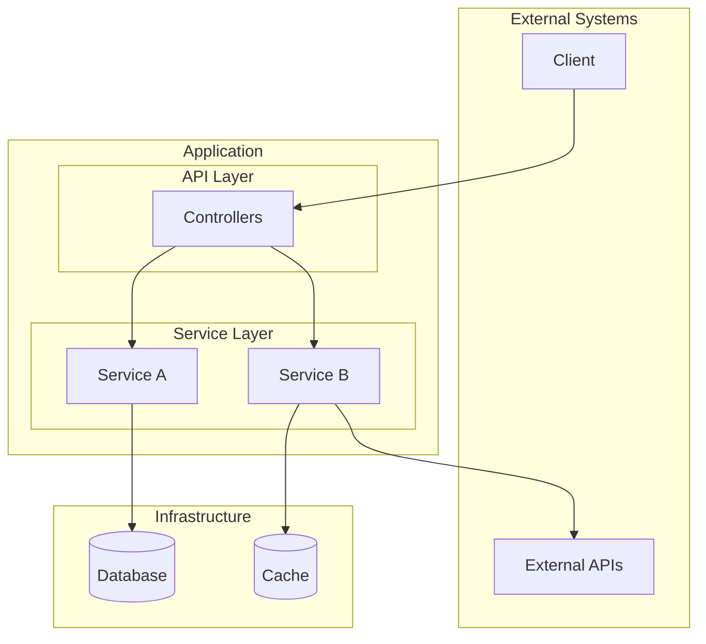
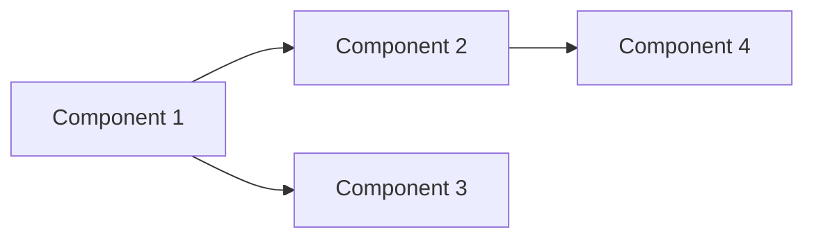

# Onboarding Template

## Overview

This template defines the structure for project onboarding documentation.
This is the ENTRY POINT for new engineers - provides high-level understanding
before diving deeper with Flow, Component, or API workflows.

---

## Output Template

````markdown
# [Project Name] - Onboarding Guide

> Generated: [DATE]
>
> **This is your entry point.** After reading this guide, use `/generate-project-docs` to explore specific flows, components, or APIs in detail.

## Table of Contents
1. [Executive Summary](#executive-summary)
2. [Technology Stack](#technology-stack)
3. [Project Structure](#project-structure)
4. [Architecture Overview](#architecture-overview)
5. [Key Components](#key-components)
6. [Main Flows](#main-flows)
7. [API Contract](#api-contract)
8. [Local Development Setup](#local-development-setup)
9. [Testing](#testing)
10. [Key Concepts](#key-concepts)
11. [Troubleshooting](#troubleshooting)
12. [Next Steps](#next-steps)
13. [Additional Resources](#additional-resources)

---

## Executive Summary

### What is [ProjectName]?

[1-2 paragraphs explaining what this project does at a high level]

### Key Characteristics

- **What**: [Type of service/library - e.g., "gRPC microservice", "REST API", "library"]
- **Why**: [Business problem it solves]
- **Who**: [Who uses this - teams, services, users]
- **Scale**: [Production characteristics - requests/day, regions, etc. if applicable]

### Business Value

[Explain how this project fits into the larger system and why it matters]

When [user/system does X]:
1. [Step 1 in the flow]
2. **[This project]** [does what]
3. [Result/outcome]

---

## Technology Stack

### Core Technologies

| Technology | Version | Purpose |
|------------|---------|---------|
| [Language] | [X.Y.Z] | Primary language |
| [Framework] | [X.Y.Z] | Application framework |
| [Database] | [X.Y.Z] | Data persistence |
| ... | ... | ... |

### Key Dependencies

| Library | Version | Purpose |
|---------|---------|---------|
| [lib-name] | [X.Y.Z] | [What it's used for] |
| ... | ... | ... |

---

## Project Structure

```
project-root/
├── src/
│   ├── main/
│   │   ├── [language]/
│   │   │   ├── [module1]/       # [Purpose]
│   │   │   ├── [module2]/       # [Purpose]
│   │   │   └── [module3]/       # [Purpose]
│   │   └── resources/
│   └── test/
├── [config-dir]/                # [Purpose]
├── [other-dir]/                 # [Purpose]
└── [build-file]                 # Build configuration
```

**Statistics**:
- **[X]** source files
- **~[Y]** lines of code
- **[Architecture pattern]** (e.g., "Layered architecture", "Hexagonal")

---

## Architecture Overview

### System Architecture

[Explain the architecture pattern and layers before showing the diagram]

The architecture follows **[pattern name]** with these layers:
- **[Layer 1]**: [What it does and why]
- **[Layer 2]**: [What it does and why]
- **[Layer 3]**: [What it does and why]



### How Requests Flow

1. [Request enters at X]
2. [Passes through Y]
3. [Data is processed/stored]
4. [Response returns]

### Key Design Patterns

- **[Pattern 1]**: [Where/why used]
- **[Pattern 2]**: [Where/why used]
- **[Pattern 3]**: [Where/why used]

---

## Key Components

This section provides a high-level map of the codebase. For deep dives, use **Component Analysis** (option 3).

### [Component 1 Name]

**Location**: `path/to/component/`

**What it does**: [2-3 sentences explaining the component's responsibility and why it exists]

**Key classes/files**:
- [MainFile.kt](../src/main/kotlin/com/example/MainFile.kt) - [One sentence about purpose]
- [Helper.kt](../src/main/kotlin/com/example/Helper.kt) - [One sentence about purpose]

**Depends on**: [Component X], [Component Y]
**Used by**: [Component A], [Component B]

> **Deep dive**: `/generate-project-docs` → option 3 → "[Component 1]"

---

### [Component 2 Name]

[Same structure...]

---

### Component Dependency Map



---

## Main Flows

This section describes the primary request/data flows. For detailed tracing, use **Flow Documentation** (option 2).

### Flow 1: [Flow Name]

**Trigger**: [What starts this flow]

**Summary**: [One paragraph describing end-to-end]

**Components involved**: `ComponentA` → `ComponentB` → `ComponentC`

**High-level steps**:
1. [Step 1]
2. [Step 2]
3. [Step 3]

> **Deep dive**: `/generate-project-docs` → option 2 → "[Flow Name]"

---

### Flow 2: [Flow Name]

[Same structure...]

---

### Flow 3: [Flow Name]

[Same structure...]

---

## API Contract

This section provides a high-level overview of the API. For detailed documentation, use **API Endpoints** (option 4).

### API Overview

| Endpoint Group | Base Path | Purpose |
|----------------|-----------|---------|
| [Group 1] | `/api/v1/[resource]` | [What these do] |
| [Group 2] | `/api/v1/[resource]` | [What these do] |

### Key Endpoints

#### [Primary Endpoint]

**Endpoint**: `[METHOD] /api/path`

**Purpose**: [What this endpoint does]

**Request**:
```json
{
  "field1": "value",
  "field2": 123
}
```

**Response**:
```json
{
  "status": "success",
  "data": { ... }
}
```

---

> **Full API documentation**: `/generate-project-docs` → option 4

---

## Local Development Setup

### Prerequisites Checklist

- [ ] **[Prerequisite 1]** - [Version/notes]
  ```bash
  [verification command]
  ```
- [ ] **[Prerequisite 2]** - [Version/notes]
- [ ] **[Prerequisite 3]** - [Version/notes]

### Quick Start

```bash
# Step 1: Clone and install
[clone command]
[install command]

# Step 2: Configure environment
[env setup]

# Step 3: Run the application
[run command]
```

### Verify Setup

```bash
# Check health
[health check command]

# Expected output
[expected output]
```

---

## Testing

### Running Tests

```bash
# Unit tests
[unit test command]

# Integration tests
[integration test command]
```

### Testing Endpoints

**Method 1: [Tool Name]**
```bash
[example command to test an endpoint]
```

**Method 2: [Tool Name]**
```bash
[example command]
```

### Understanding Results

Key response fields to check:
- `[field1]` - [What it means]
- `[field2]` - [What it means]

---

## Key Concepts

Important terminology and concepts to understand:

| Term | Definition |
|------|------------|
| [Term 1] | [What it means in this project] |
| [Term 2] | [What it means] |
| [Term 3] | [What it means] |

---

## Troubleshooting

### Common Issues

#### [Issue 1: Error/symptom]

**Cause**: [Why this happens]

**Solution**:
```bash
[fix command or steps]
```

---

#### [Issue 2: Error/symptom]

**Cause**: [Why]

**Solution**: [Steps]

---

### Debugging Tips

- [Tip 1]
- [Tip 2]
- [Tip 3]

---

## Next Steps

### Learning Path

**Week 1 – Setup & Orientation:**
- [ ] Complete prerequisites installation
- [ ] Build and run locally
- [ ] Test basic endpoints
- [ ] Read through this guide

**Week 2 – Core Understanding:**
- [ ] Study [Key Component 1] - **File**: [Component1.kt](path/to/Component1.kt)
- [ ] Study [Key Component 2] - **File**: [Component2.kt](path/to/Component2.kt)
- [ ] Trace a request through the main flow

**Week 3+ – Deep Dives & Advanced Topics:**
Use `/generate-project-docs` for detailed documentation on specific areas.

### Priority Areas

| Priority | Area | Type | Why Important | Command |
|----------|------|------|---------------|---------|
| ⭐⭐⭐ | [Flow/Component] | Flow | [Core functionality] | option 2 |
| ⭐⭐⭐ | [Component] | Component | [Business logic] | option 3 |
| ⭐⭐ | [Flow/Component] | Flow | [Common operation] | option 2 |
| ⭐⭐ | [Component] | Component | [Frequently modified] | option 3 |
| ⭐ | API Endpoints | API | [Full contracts] | option 4 |

### How to Use Other Workflows

| Need to understand... | Use | Command |
|-----------------------|-----|---------|
| How a request flows through the system | Flow Documentation | option 2 |
| A specific class/module in depth | Component Analysis | option 3 |
| All API endpoints with schemas | API Endpoints | option 4 |

---

## Additional Resources

### Documentation
- **[Doc 1]**: [Link or path]
- **[Doc 2]**: [Link or path]

### Communication
- **[Channel 1]**: [Purpose]
- **[Channel 2]**: [Purpose]

### Monitoring & Observability
- **[Tool 1]**: [Link - what it shows]
- **[Tool 2]**: [Link - what it shows]

### Deployment
- **[Tool]**: [Link - deployment info]

---

*This document was generated by analyzing the codebase. It's your entry point - use the other documentation workflows to explore specific areas in depth.*
````

---

## Guidelines

- This is the ENTRY POINT - provide enough context to understand the system
- **Executive Summary** establishes business context (What, Why, Who, Scale)
- **Project Structure** shows actual directory layout with purposes
- **Architecture must have explanation** before diagram
- **Key Components** have 2-3 sentences each + dependencies
- **Main Flows** are high-level summaries with deep dive pointers
- **Local Development Setup** has prerequisites checklist
- **Key Concepts** explains domain terminology
- **Next Steps** includes learning path with file references
- **Additional Resources** links to docs, Slack, monitoring
- Include "Deep dive" callouts pointing to other workflows

---

## Success Criteria

Onboarding document is complete when:

- All sections from template are filled with project-specific content
- Executive Summary has What/Why/Who/Scale
- Architecture diagram has explanation before it
- Key Components have 2-3 sentences each with file references
- File references use format: [Name.kt](../path/to/Name.kt)
- Learning path includes file references to key components
- Deep dive pointers included for flows, components, and API
