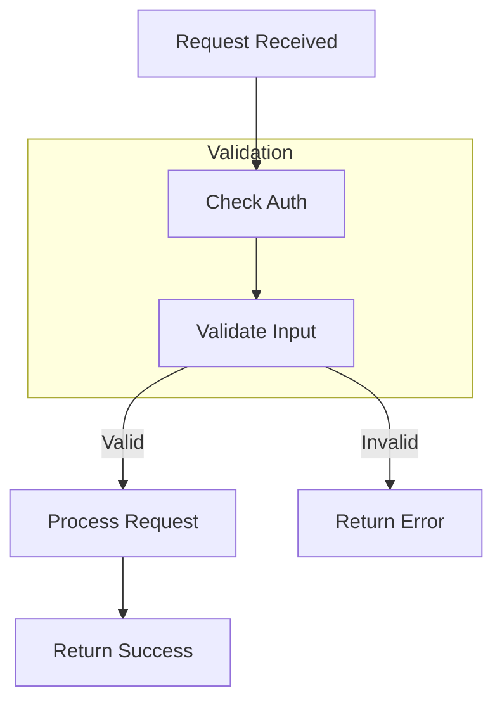

# Create Flow Documentation Workflow

## Required Reading

**Read these reference files NOW:**
1. `references/flow-template.md`
2. `references/mermaid-best-practices.md`

---

## Process

### Step 1: Setup and Identify Flow

```bash
mkdir -p claude-docs/diagrams
```

Ask user to specify which flow to document:
- "Which flow would you like to document? (e.g., user authentication, order processing, file upload)"

Check for existing flow documentation:
```bash
ls -la claude-docs/Flow_*.md 2>/dev/null
```

---

### Step 2: Find the Entry Point

Locate where this flow begins:

1. **For HTTP flows**: Find the route definition
   - Express: `app.get/post/put` or router files
   - FastAPI: `@app.get/post` decorators
   - Django: urls.py patterns
   - Spring: `@RequestMapping` annotations

2. **For event flows**: Find the event handler/listener
   - Message queue consumers
   - Event emitters/subscribers
   - Cron jobs or schedulers

3. **For CLI flows**: Find the command handler
   - argparse/click handlers
   - CLI entry points

Document with clickable link (relative from claude-docs/):
**File**: [EntryPoint.kt](../src/main/kotlin/com/example/EntryPoint.kt) (Line 45)

---

### Step 3: Trace the Flow Step by Step

Follow the execution path through the codebase:

For each step:
1. **Function/method called**: Name and file reference - [Method.kt](../src/main/kotlin/path/to/Method.kt) (Line XX)
2. **Input**: What data comes in
3. **Processing**: What transformation or logic happens
4. **Output**: What data goes out
5. **Side effects**: Database writes, external API calls, events emitted

Use grep/search to find:
- Function definitions
- Where functions are called
- Import statements to trace dependencies

**Be explicit about what you can and cannot verify.** If a code path has multiple branches, document the main path and note alternatives.

---

### Step 4: Identify External Interactions

Document all external service interactions:

1. **Database operations**: Queries, inserts, updates
2. **External APIs**: HTTP calls to other services
3. **Message queues**: Messages published/consumed
4. **Cache operations**: Redis, Memcached, etc.
5. **File system**: Reads, writes, uploads

For each, note:
- What data is sent/received
- Error handling for failures
- Timeout/retry configuration

---

### Step 5: Document Error Handling

Trace what happens when things go wrong:

1. **Validation failures**: How bad input is handled
2. **External service failures**: Timeouts, errors from dependencies
3. **Business logic errors**: Domain-specific error conditions
4. **Unhandled errors**: How exceptions bubble up

Include the error response format and any logging.

---

### Step 6: Create Flow Diagram

**Follow `references/mermaid-best-practices.md` for clean, non-overlapping diagrams.**

Create a Mermaid sequence or flowchart diagram:

**Use sequence diagram for:**
- Request/response flows between components
- Multi-service interactions
- Async messaging patterns

**Use flowchart for decision/processing flows:**
- Use `flowchart TD` (not `graph TD`) for better edge routing
- Add `direction LR` inside subgraphs with parallel components
- Declare nodes first, then edges at the bottom

**Example flowchart with best practices:**


Include only significant steps; don't diagram every function call.

---

### Step 7: Write the Document

Using the template from `references/flow-template.md`:

1. **Table of Contents** at the top
2. Document each step with file references: [File.kt](../path) (Line XX)
3. Include the flow diagram (sequence or flowchart)
4. Add "Next Steps" suggesting related flows
5. Save to `claude-docs/Flow_[FlowName].md`

---

### Step 8: Render Diagrams

```bash
python3 ~/.claude/skills/generate-project-docs/scripts/render_mermaid.py claude-docs/Flow_[FlowName].md
```

---

## Success Criteria

Flow documentation is complete when:

- [ ] Table of Contents at top
- [ ] Entry point identified with file reference: [Name.kt](../path) (Line XX)
- [ ] Each step documented with input/output/processing
- [ ] External interactions mapped
- [ ] Error handling paths documented
- [ ] Flow diagram created (sequence or flowchart)
- [ ] All code references are verifiable
- [ ] Diagrams rendered to images
- [ ] Related flows suggested in "Next Steps"
