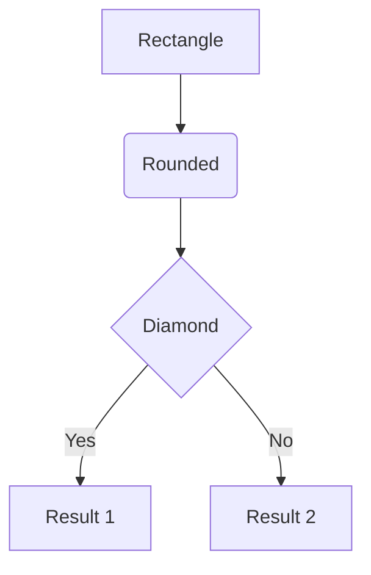
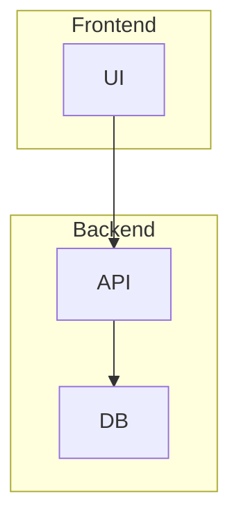
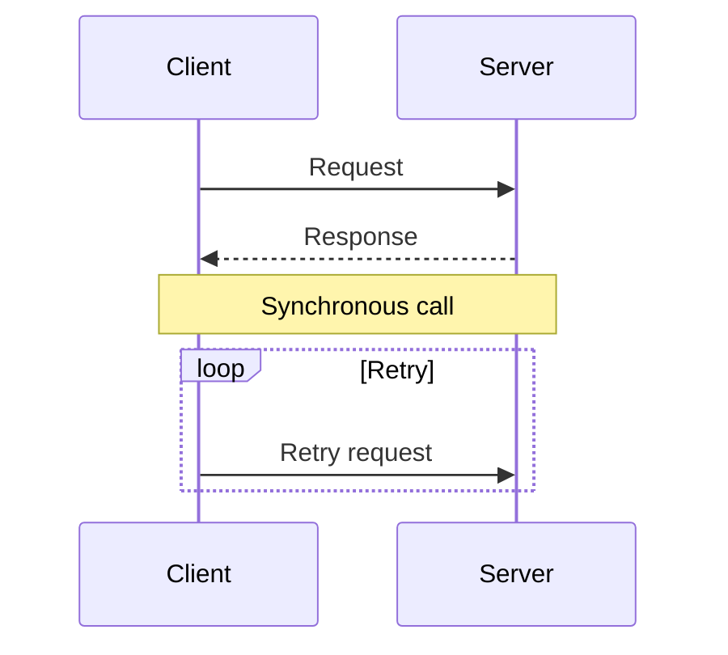
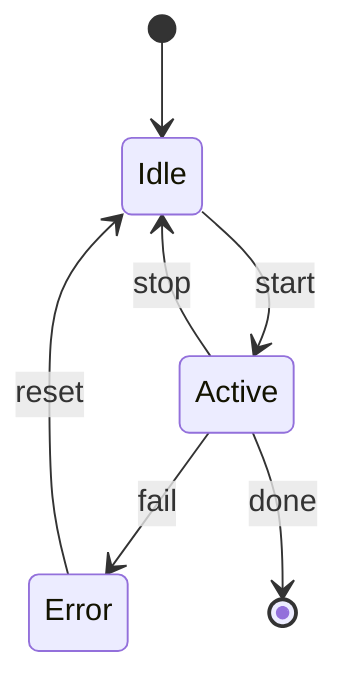
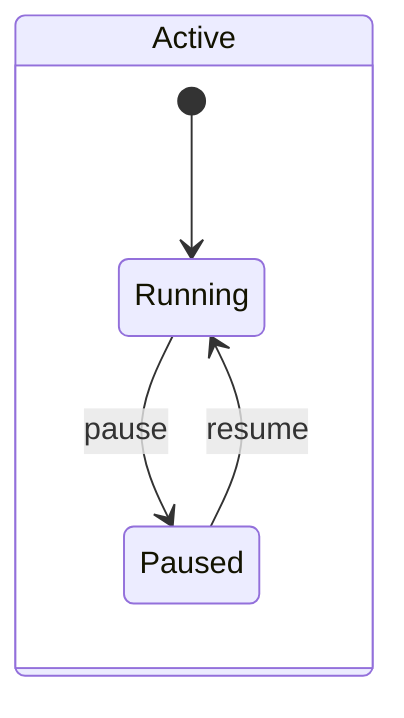
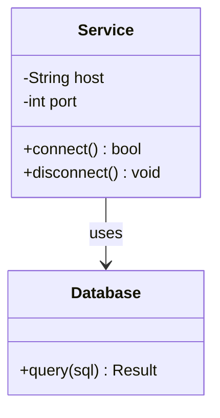
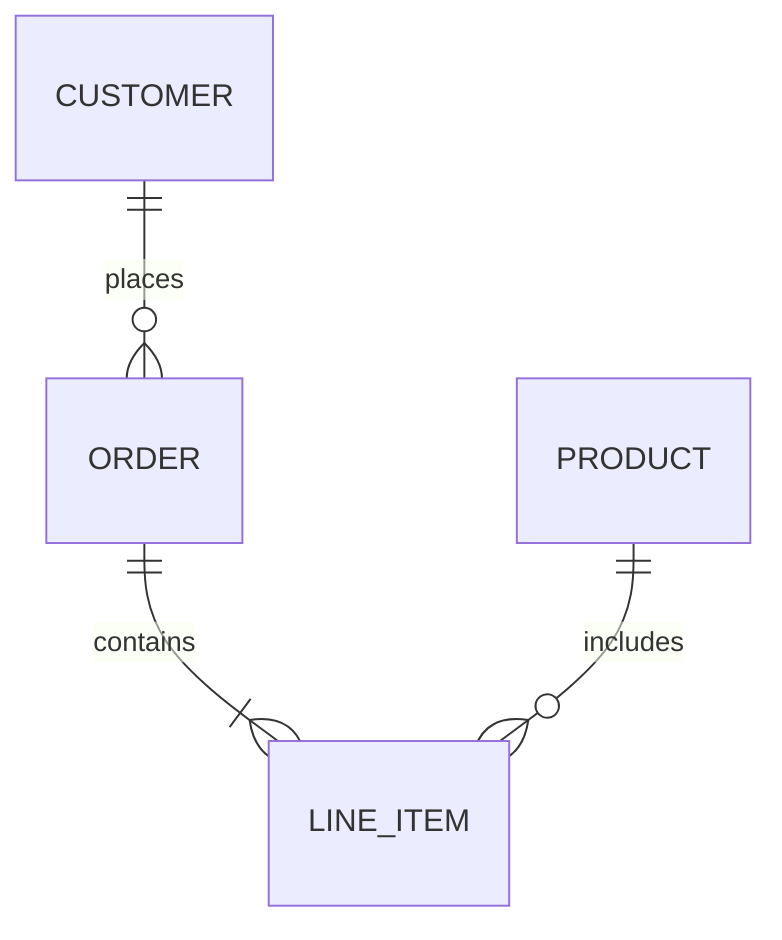

# Mermaid Diagram Creator

Generate and render Mermaid diagrams as ASCII art or standalone HTML pages.

This skill uses [mermaid-diagram-cli](https://github.com/lukilabs/beautiful-mermaid), a CLI wrapper around [beautiful-mermaid](https://github.com/lukilabs/beautiful-mermaid). The CLI is bundled as `scripts/index.js` so no additional installation is required.

## When to Use This Skill

- Visualize architecture or system design as flowcharts
- Create sequence diagrams for API or service interactions
- Document state machines or workflows
- Generate class diagrams or ER diagrams for data modeling
- Add visual diagrams to PR descriptions or documentation
- Quick terminal preview of a diagram with ASCII art

## Quick Start

1. Write a `.mmd` file with Mermaid syntax using the **Write** tool (always use the `.mmd` extension)
2. Render it with the **Bash** tool using the CLI script
3. Keep the `.mmd` file so the user can edit and re-render later

```bash
# Render to HTML (default, open in browser)
bun scripts/index.js --file diagram.mmd --output diagram.html

# Render to ASCII (terminal preview)
bun scripts/index.js --file diagram.mmd --format ascii
```

## CLI Commands Reference

All commands use the bundled `mermaid-diagram-cli` and are run from the skill directory with `bun scripts/index.js` or `node scripts/index.js`.

### Render to HTML (default)

```bash
bun scripts/index.js --file diagram.mmd --output diagram.html
```

Produces a standalone HTML file that loads [beautiful-mermaid](https://github.com/lukilabs/beautiful-mermaid) from CDN and renders in-browser. No dependencies needed to view.

### Render to ASCII

```bash
bun scripts/index.js --file diagram.mmd --format ascii
```

Prints Unicode box-drawing art to stdout and echoes the Mermaid AST to stderr.

### Render ASCII to File

```bash
bun scripts/index.js --file diagram.mmd --format ascii --output diagram.txt
```

Writes the ASCII diagram to a file instead of printing to stdout.

### With a Theme

```bash
bun scripts/index.js --file diagram.mmd --theme dracula --output diagram.html
```

### Show Example Diagrams

```bash
bun scripts/index.js --examples
```

Prints one concise example for each of the 5 supported diagram types.

### Help

```bash
bun scripts/index.js --help
```

### CLI Flags

| Flag | Type | Default | Description |
|------|------|---------|-------------|
| `--file <path>` | string | — | **Required.** Read mermaid source from a `.mmd` file |
| `--output <path>` | string | `diagram.html` (html), stdout (ascii) | Output file path |
| `--format <type>` | string | `html` | Output format: `ascii` or `html` |
| `--theme <name>` | string | `zinc-light` | Built-in theme name |
| `--examples` | boolean | `false` | Print example diagrams |
| `--help` | boolean | `false` | Print usage info |

## Mermaid Syntax Guide

### Flowcharts



**Directions:** `TD` (top-down), `LR` (left-right), `BT` (bottom-top), `RL` (right-left)

**Node shapes:** `[text]` rectangle, `(text)` rounded, `{text}` diamond, `([text])` stadium, `((text))` circle

**Edge types:** `-->` arrow, `---` line, `-.->` dotted arrow, `==>` thick arrow, `-->|label|` labeled

**Subgraphs:**


### Sequence Diagrams



**Message types:** `->>` solid arrow, `-->>` dashed arrow, `--)` async, `-x` lost

**Blocks:** `loop`, `alt/else`, `opt`, `par`, `critical`, `break`

### State Diagrams



**Composite states:**


### Class Diagrams



**Relationships:** `<|--` inheritance, `*--` composition, `o--` aggregation, `-->` association, `..>` dependency

**Visibility:** `+` public, `-` private, `#` protected, `~` package

### ER Diagrams



**Cardinality:** `||` exactly one, `o|` zero or one, `}|` one or more, `}o` zero or more

## Available Themes

| Theme | Type |
|-------|------|
| `zinc-light` | Light |
| `zinc-dark` | Dark |
| `tokyo-night` | Dark |
| `tokyo-night-storm` | Dark |
| `tokyo-night-light` | Light |
| `catppuccin-mocha` | Dark |
| `catppuccin-latte` | Light |
| `nord` | Dark |
| `nord-light` | Light |
| `dracula` | Dark |
| `github-light` | Light |
| `github-dark` | Dark |
| `solarized-light` | Light |
| `solarized-dark` | Dark |
| `one-dark` | Dark |

Default theme when none specified: `zinc-light` (white background, dark text).

## Agent Workflow

**You MUST always create a `.mmd` file before rendering.** Never pass Mermaid syntax as an inline argument. The `--file` flag is required for all render commands.

Follow these steps when generating a diagram:

1. **Generate the Mermaid syntax** — construct the diagram source string based on the context
2. **Write a `.mmd` file** — use the Write tool to create a Mermaid source file with the `.mmd` extension (e.g., `diagram.mmd`). This step is mandatory — the CLI requires a file input via `--file`
3. **Render the diagram** — use the Bash tool to run the CLI script with `--file`. When the user requests multiple formats, render all of them before cleaning up:
   - For HTML: `bun scripts/index.js --file diagram.mmd --output diagram.html`
   - For ASCII: `bun scripts/index.js --file diagram.mmd --format ascii --output diagram.txt`
   - For ASCII preview only (quick validation): `bun scripts/index.js --file diagram.mmd --format ascii`
4. **Keep the `.mmd` file** — preserve the Mermaid source file after rendering so the user can edit and re-render later. Only delete it if the user explicitly asks to remove it.
5. **Confirm output** — verify all requested output files were created

## Output Formats

| Format | Output | Description |
|--------|--------|-------------|
| `html` | File | Standalone HTML page using CDN bundle, opens in any browser |
| `ascii` | Stdout or File | Unicode box-drawing art; prints to terminal by default, or writes to file with `--output` |

## Best Practices

- **Start with ASCII** — use `--format ascii` to quickly validate diagram syntax in the terminal before generating HTML
- **Keep diagrams focused** — break complex systems into multiple smaller diagrams rather than one large diagram
- **Keep `.mmd` sources** — preserve `.mmd` files after rendering so they can be edited and re-rendered; only delete if the user asks
- **Use themes** — match the diagram theme to the target context (e.g., `github-light` for light-mode docs, `dracula` for dark-mode docs)
